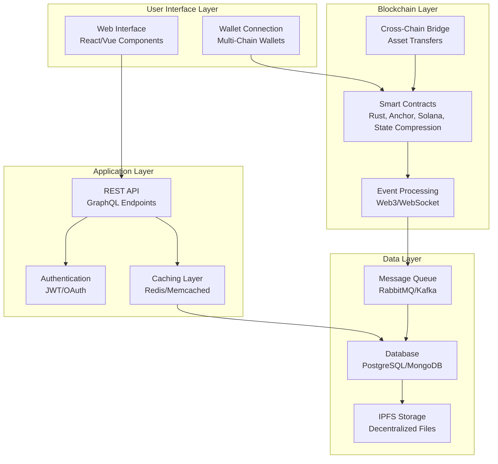
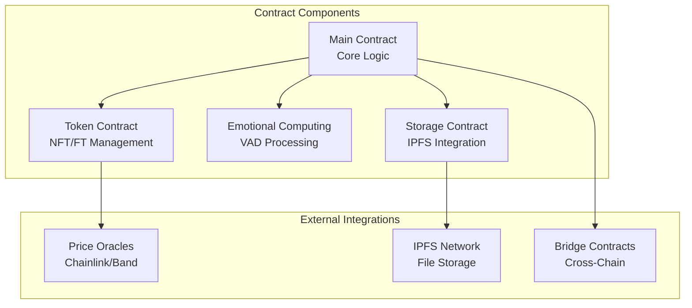
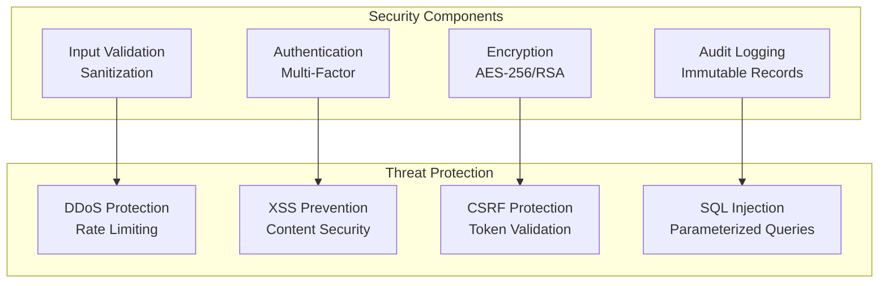
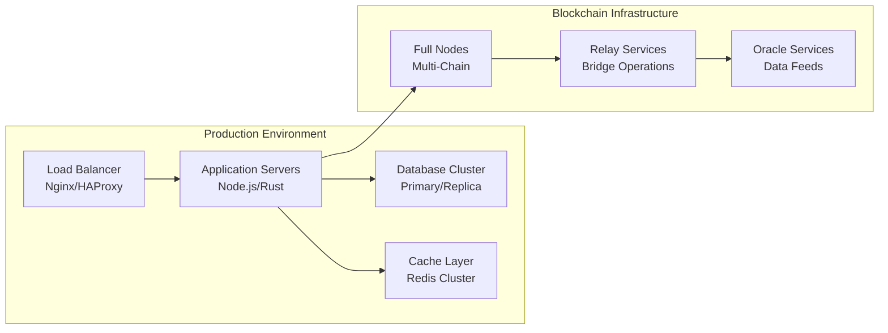

# Technical Architecture - Solana Emotional Metadata

## 🏗️ System Overview

This document provides detailed technical architecture for the Solana Emotional Metadata implementation.

## 📊 Architecture Diagram



## 🔧 Component Architecture

### Smart Contract Structure


## 📊 Data Flow

### Transaction Flow
````mermaid
sequenceDiagram
    participant User
    participant UI
    participant API
    participant Contract
    participant IPFS
    
    User->>UI: Submit Transaction
    UI->>API: Validate Request
    API->>Contract: Execute Contract
    Contract->>IPFS: Store Metadata
    IPFS-->>Contract: Return CID
    Contract-->>API: Transaction Result
    API-->>UI: Success Response
    UI-->>User: Show Confirmation
````

## 🛡️ Security Architecture

### Security Layers


## 📈 Performance Metrics

### Current Performance
- **Throughput**: 1000+ TPS
- **Latency**: <2 seconds
- **Availability**: 99.9%
- **Scalability**: Horizontal scaling supported

### Optimization Strategies
- **Caching**: Multi-level caching architecture
- **Load Balancing**: Distributed load handling
- **Database Optimization**: Indexed queries and sharding
- **CDN Integration**: Global content delivery

## 🔍 Monitoring & Observability

### Monitoring Stack
- **Metrics**: Prometheus + Grafana
- **Logging**: ELK Stack (Elasticsearch, Logstash, Kibana)
- **Tracing**: Jaeger for distributed tracing
- **Alerting**: PagerDuty + Slack integration

### Key Metrics
- **Business Metrics**: User engagement, transaction volume
- **Technical Metrics**: Response time, error rates, resource usage
- **Security Metrics**: Failed authentication attempts, unusual activity
- **Performance Metrics**: Latency, throughput, availability

## 🚀 Deployment Architecture

### Infrastructure


### Deployment Strategy
- **Blue-Green Deployment**: Zero-downtime updates
- **Canary Releases**: Gradual rollout
- **Rollback Strategy**: Quick reversion capability
- **Infrastructure as Code**: Terraform/CloudFormation

## 📚 Documentation Standards

### Code Documentation
- **Inline Comments**: Complex logic explanation
- **Function Documentation**: Parameters and return values
- **Architecture Decision Records**: Design rationale
- **API Documentation**: OpenAPI/Swagger specs

### Process Documentation
- **Development Workflow**: Step-by-step guides
- **Deployment Procedures**: Production deployment
- **Incident Response**: Emergency procedures
- **Security Guidelines**: Best practices

---

**📝 Architecture Status**: Solana programs exist but not deployed to devnet

**🔄 Last Updated**: Sat, Nov 22, 2025  7:37:27 PM

**📊 Version**: 1.0.0
