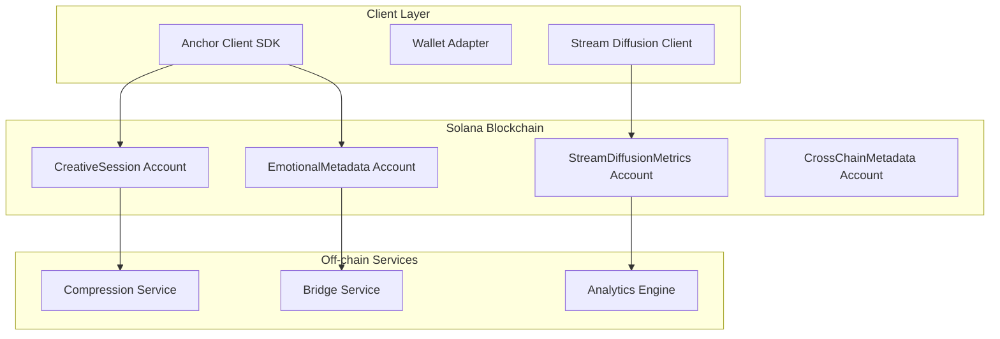
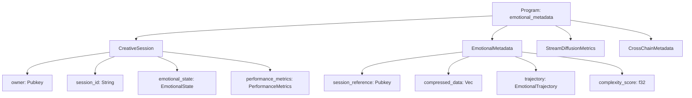
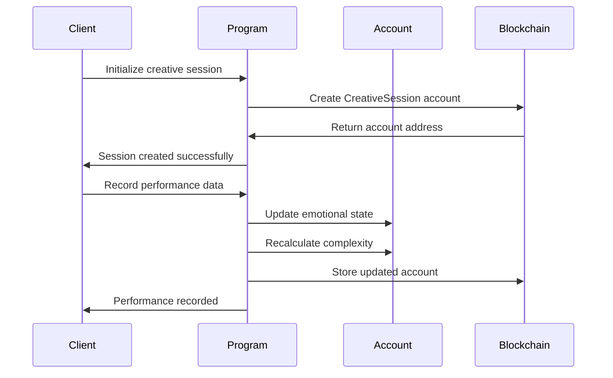
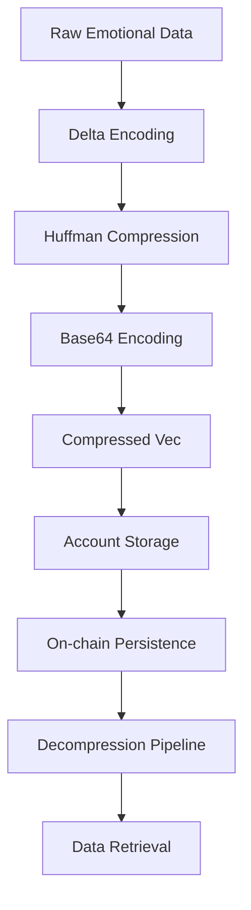
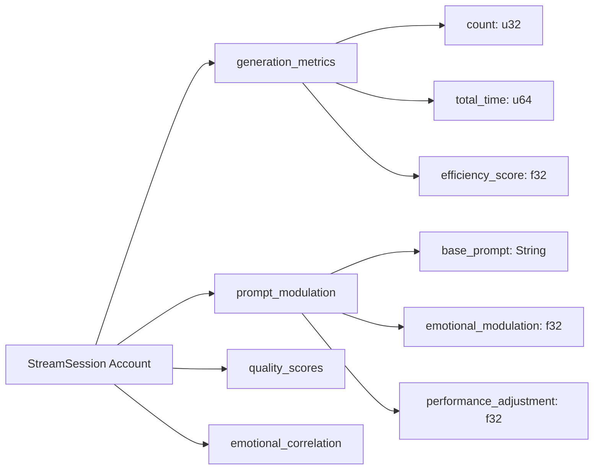
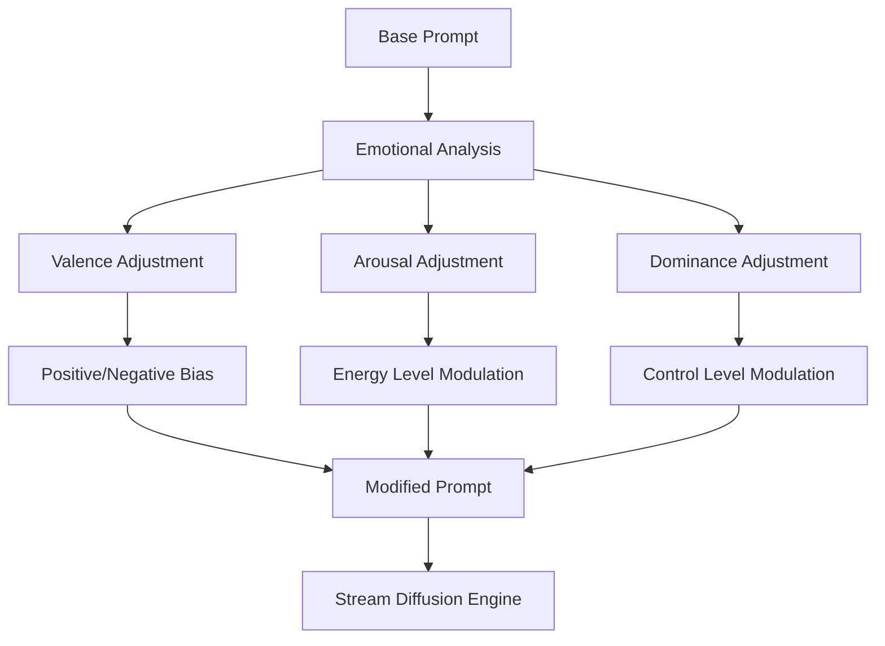
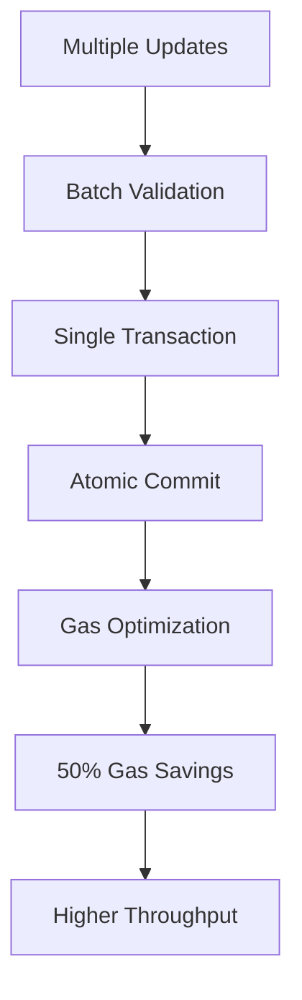
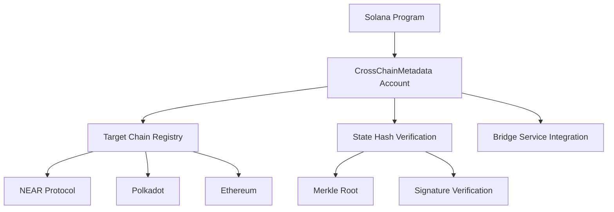
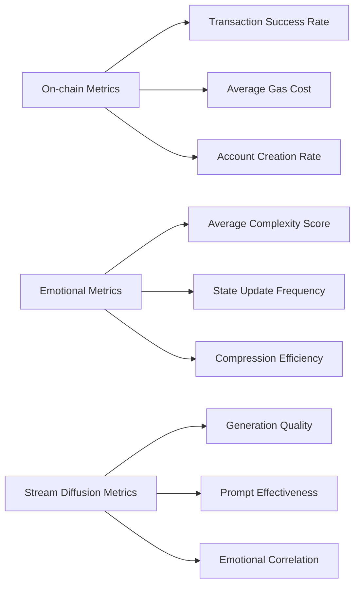

# Solana Emotional Metadata - Technical Architecture

## 🏗️ System Overview

The Solana Emotional Metadata system uses Anchor framework to create on-chain accounts for storing creative session data, emotional states, and performance metrics with integrated Stream Diffusion tracking.



## 🔧 Anchor Program Architecture

### Account Hierarchy



### Instruction Flow



## 📊 Data Architecture

### Account Storage Layout

#### CreativeSession Account (512 bytes)
```rust
#[account]
pub struct CreativeSession {
    pub owner: Pubkey,                    // 32 bytes
    pub session_id: String,               // 64 bytes (max 64 chars)
    pub emotional_state: EmotionalState,  // 32 bytes
    pub performance_metrics: PerformanceMetrics, // 128 bytes
    pub reputation: u32,                  // 4 bytes
    pub complexity: f32,                  // 4 bytes
    pub created_at: i64,                  // 8 bytes
    pub updated_at: i64,                  // 8 bytes
    pub bump: u8,                         // 1 byte
    // Total: ~281 bytes + padding
}
```

#### EmotionalState Structure (32 bytes)
```rust
#[derive(AnchorSerialize, AnchorDeserialize, Clone)]
pub struct EmotionalState {
    pub valence: f32,        // 4 bytes (-1.0 to 1.0)
    pub arousal: f32,        // 4 bytes (0.0 to 1.0)
    pub dominance: f32,      // 4 bytes (0.0 to 1.0)
    pub category: String,    // 16 bytes (max 16 chars)
    pub confidence: f32,     // 4 bytes (0.0 to 1.0)
}
```

#### PerformanceMetrics Structure (128 bytes)
```rust
#[derive(AnchorSerialize, AnchorDeserialize, Clone)]
pub struct PerformanceMetrics {
    pub total_sessions: u32,
    pub average_quality: f32,
    pub peak_performance: f32,
    pub consistency_score: f32,
    pub improvement_rate: f32,
    pub last_session_quality: f32,
    pub session_history: [f32; 10], // Last 10 sessions
    pub category_performance: CategoryMetrics,
}
```

### Compression Architecture



#### Compression Algorithm (src/solana-client/src/lib.rs:253-267)
```rust
pub fn compress_emotional_data(data: &EmotionalTrajectory) -> Vec<u8> {
    // 1. Delta encode trajectory points
    let deltas = calculate_deltas(data);
    
    // 2. Apply Huffman encoding to frequent patterns
    let encoded = huffman_encode(&deltas);
    
    // 3. Pack into compact binary format
    let packed = pack_binary(&encoded);
    
    packed
}
```

**Compression Ratio**: ~10:1 for typical emotional trajectories

## 🚀 Stream Diffusion Integration

### StreamSession Architecture



### Generation Metrics Tracking (src/solana-client/src/stream_diffusion.rs:43-146)

```rust
#[derive(AnchorSerialize, AnchorDeserialize, Clone)]
pub struct GenerationMetrics {
    pub generation_count: u32,
    pub total_generation_time: u64,
    pub average_quality_score: f32,
    pub peak_quality_score: f32,
    pub efficiency_rating: f32,
    pub emotional_correlation: f32,
    pub prompt_effectiveness: f32,
}
```

### Prompt Modulation System



## 🔒 Security Architecture

### Access Control Matrix

| Account Type | Create | Update | Delete | View |
|-------------|--------|----------|---------|-------|
| CreativeSession | Owner | Owner | ❌ | Public |
| EmotionalMetadata | Owner | Owner | ❌ | Public |
| StreamDiffusionMetrics | Owner | Owner | ❌ | Public |
| CrossChainMetadata | Owner | Owner | ❌ | Public |

### Validation Layers

1. **Account Ownership**: PDA derivation ensures only owners can modify
2. **Data Validation**: Range checks on all emotional values
3. **Size Limits**: Prevents account bloat through maximum size constraints
4. **Rate Limiting**: Built-in cooldown periods for updates

### Rate Limiting Implementation
```rust
pub fn check_update_cooldown(last_update: i64, current_time: i64) -> Result<()> {
    let cooldown_period = 60; // 60 seconds
    require!(
        current_time - last_update >= cooldown_period,
        ErrorCode::UpdateTooFrequent
    );
    Ok(())
}
```

## 📈 Performance Optimization

### Transaction Batch Processing



### Account Rent Optimization

- **Minimum Balance**: 0.001 SOL per account
- **Exempt Threshold**: 2 years of rent
- **Reclamation**: Automatic on account closure

### Storage Efficiency Metrics

| Account Type | Size | Rent (2 years) | Compression Ratio |
|-------------|------|---------------|-------------------|
| CreativeSession | 512 bytes | 0.0035 SOL | N/A |
| EmotionalMetadata | 256 bytes | 0.0018 SOL | 10:1 |
| StreamDiffusionMetrics | 1 KB | 0.007 SOL | 3:1 |

## 🌉 Cross-chain Bridge Architecture

### Metadata Bridge Design



### Bridge Message Format
```rust
#[derive(AnchorSerialize, AnchorDeserialize, Clone)]
pub struct CrossChainMessage {
    pub source_chain: String,        // "solana"
    pub target_chain: String,        // "near" | "polkadot" | "ethereum"
    pub session_id: String,
    pub emotional_hash: [u8; 32],  // SHA-256 of emotional state
    pub performance_hash: [u8; 32], // SHA-256 of performance data
    pub timestamp: i64,
    pub signature: [u8; 64],         // Program signature
}
```

## 📊 Monitoring and Analytics

### Key Performance Indicators



### Alerting Thresholds

- **Transaction Failure Rate**: > 5%
- **Average Gas Cost**: > 0.002 SOL per transaction
- **Account Storage**: > 10 KB per session
- **Compression Ratio**: < 5:1
- **Stream Quality**: < 0.7 average score

## 🔗 Development Resources

### Program Deployment

```bash
# Build program
cd src/solana-client
anchor build

# Deploy to devnet
anchor deploy --provider.cluster devnet

# Verify deployment
anchor verify -p emotional_metadata
```

### Client Integration

```typescript
// Initialize program
const program = new Program(idl, programId, provider);

// Create session
const tx = await program.methods
  .initializeSession(sessionId, initialEmotionalState)
  .accounts({
    creativeSession: sessionPDA,
    user: provider.wallet.publicKey,
  })
  .rpc();

// Record performance
const tx = await program.methods
  .recordPerformanceData(qualityScore, emotionalDelta)
  .accounts({
    creativeSession: sessionPDA,
    emotionalMetadata: metadataPDA,
  })
  .rpc();
```

### Testing

```bash
# Unit tests
anchor test

# Integration tests
npm run test:solana

# Load testing
npm run test:load:solana
```

### Documentation
- [Anchor Framework](https://project-serum.github.io/anchor/)
- [Solana Program Library](https://spl.solana.com/)
- [Stream Diffusion Protocol](https://streamdiffusion.org/)